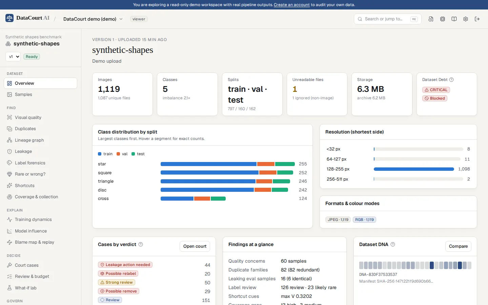
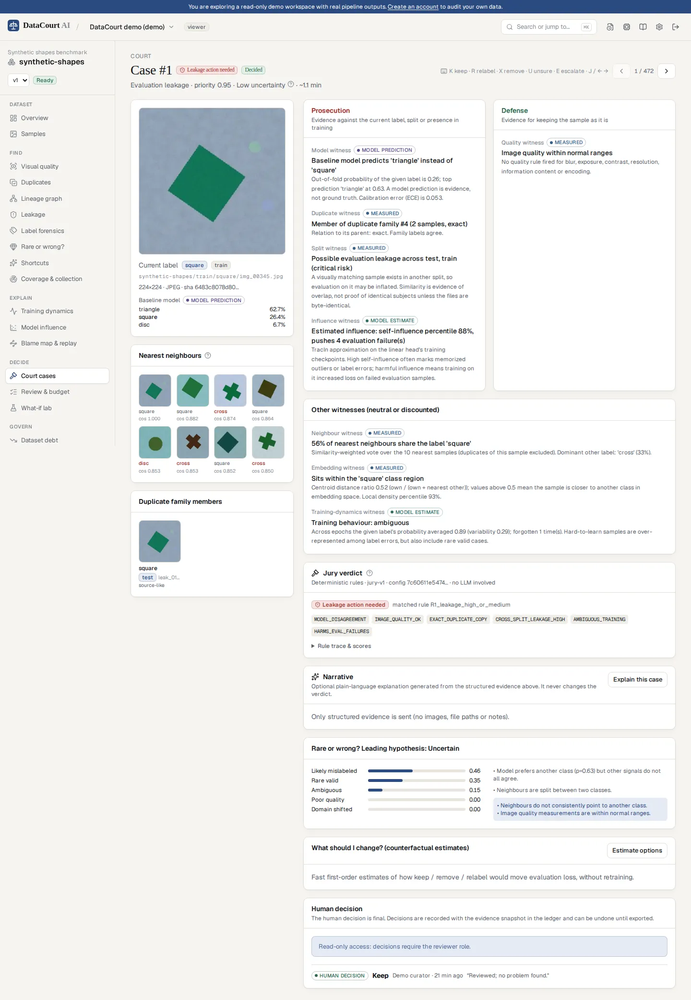
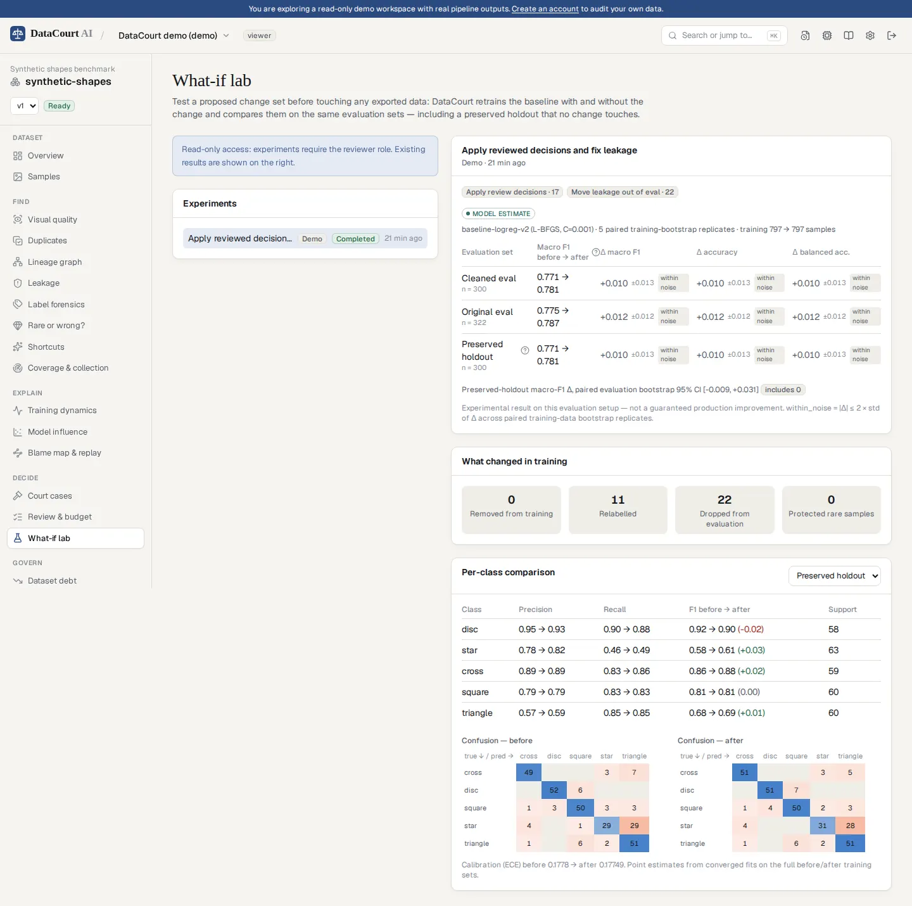
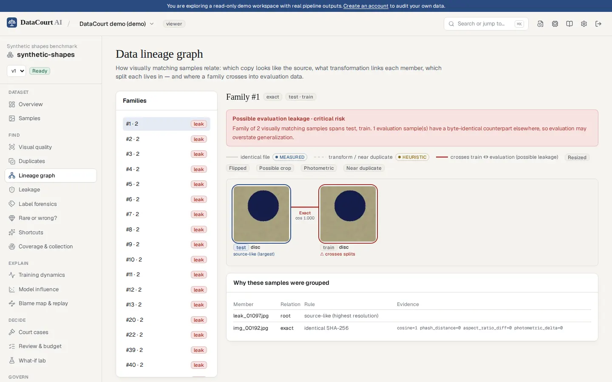
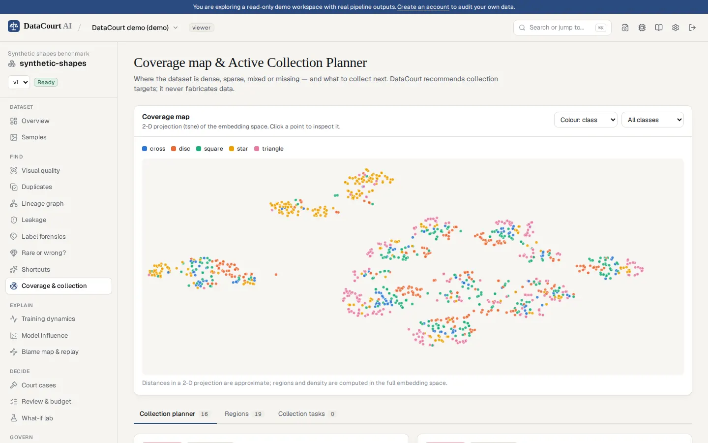

# DataCourt AI

**Put your dataset on trial before your model pays the price.**

DataCourt AI is an evidence-driven dataset forensics and decision-intelligence platform for image classification. It builds *cases* around suspicious training samples, prioritises human review by expected impact, traces model failures back to the training data that caused them, and tests whether a data change actually improves the model before anything is exported.

> Most tools answer *"what looks wrong?"*
> DataCourt answers *"what looks wrong, why does it matter, what should a human do first, and can we show that fixing it helps?"*

**FIND → EXPLAIN → PRIORITISE → REVIEW → TEST → PROVE → EXPORT**

- **Live site:** [datacourt-ai.vercel.app](https://datacourt-ai.vercel.app): product overview and full documentation. The hosted backend (API, workspaces and the read-only demo) is not deployed yet; see [Deployment status](#deployment-status). Everything runs locally today.
- **Docs:** [Methodology](docs/METHODOLOGY.md) · [Evaluation](docs/EVALUATION.md) · [Architecture](docs/ARCHITECTURE.md) · [Security](docs/SECURITY.md) · [Privacy](docs/PRIVACY.md) · [Dataset formats](docs/DATASET_FORMATS.md) · [CI & API](docs/API.md) · [Algorithm versions](docs/ALGORITHM_VERSIONS.md) · [Novelty](docs/NOVELTY.md) · [Deployment](docs/DEPLOYMENT.md)



| Court case: prosecution, defence, witnesses and jury | What-if Lab: before/after on a preserved holdout |
|---|---|
|  |  |
| **Lineage graph of a duplicate family crossing into test** | **Coverage map and Active Collection Planner** |
|  |  |

## Features

**Find**
- Safe ZIP ingestion with layout detection (split-first, class-first, class-only), provenance and rejected-file reasons. JPEG, PNG, WebP, BMP, TIFF, GIF and HEIC/HEIF (iPhone photos), measured upright; originals are kept unchanged.
- Visual quality rules (blur, exposure, contrast, near-empty, resolution, aspect ratio, extension mismatch) using absolute and dataset-relative evidence.
- Duplicate *families* (exact, resized, photometric, flipped, possible crop, near) verified structurally, with an interactive lineage graph.
- Train/validation/test leakage graded by risk, plus adaptive similar-subject clusters.
- Label forensics with reliability-weighted witnesses. **Rare-or-Wrong** competing hypotheses protect unusual but valid data.
- Shortcut detective: Cramér's V, lift, cue-only predictability, and border/content perturbation tests.
- Coverage map, gap detection and an **Active Collection Planner** that says what to collect.
- Privacy scan for potential faces and text (detection only, no recognition).

**Explain & prioritise**
- Out-of-fold baseline with calibration, training dynamics (dataset cartography) and TracIn influence.
- **Model-to-Data Blame Map** and **Failure Replay** for individual evaluation errors.
- **Case Court**: prosecution vs defence evidence, a deterministic versioned jury (rules R1–R10 with a trace), uncertainty and priority.
- **Review Budget** optimiser (items or minutes) with diminishing returns per family and class.
- "Explain everything" glossary and optional Gemini narratives, restricted to wording.

**Review, test, prove, export**
- Keyboard-first review, multi-reviewer consensus, disputes and adjudication, undo, and counterfactual action estimates.
- **What-if Lab**: retrain on a proposed change set and compare on a preserved holdout, with training-noise and evaluation bootstraps.
- **Dataset Debt** (8 dimensions, published formulas), **preflight gate**, **data contracts** and a CI endpoint with the `datacourt-ci` command.
- **Version intelligence**, **Dataset DNA** and drift, and evaluation-contamination checks.
- **Evidence ledger** (hash chain), clean export from human decisions only, and an HTML/JSON audit report.
- Workspaces with owner/admin/reviewer/viewer roles, API tokens, a security log, retention, and workspace and account deletion.

## Architecture

```
Browser ──► Vercel (one project):  Next.js 16 UI  +  FastAPI /api/* (orchestration, no ML) ──► Postgres (Neon)
   │                                                   │ workflow_dispatch          ▲
   │                                                   ▼                            │ state, progress
   │                                GitHub Actions: DataCourt worker (ingest, audit, what-if, export, report)
   │                                                   │
   └── presigned PUT/GET (direct uploads, downloads) ──┴──► Object storage (Backblaze B2, private)
                                       Gemini (optional, wording only) ◄── API
```

- **Web**: Next.js App Router, React 19, TypeScript, Tailwind 4, SWR. Charts are hand-built SVG and canvas with a validated colour palette, dark mode and table fallbacks.
- **API**: FastAPI with 92 operations under `/api/v1`, SQLAlchemy 2, Alembic, psycopg 3, and 63 tables.
- **Jobs**: a Postgres queue with `FOR UPDATE SKIP LOCKED` claims, time limits, heartbeats, reaping, retries and classified failures. In production the API dispatches GitHub Actions runs that drain the queue. The same worker also runs as a dedicated process (or GPU box) or embedded for local development.
- **ML**: NumPy, scikit-learn, OpenCV and FAISS on CPU by default (`dc-descriptor-v1` embeddings). Optional DINOv2.

See [docs/ARCHITECTURE.md](docs/ARCHITECTURE.md).

## Evaluation (synthetic benchmark, seed 7, CPU descriptor backend)

| Area | Result |
|---|---|
| Duplicate pairs | precision **1.00**, recall **0.976** (crops 0.8) |
| Cross-split leakage | precision **1.00**, recall **1.00** |
| Label-error ranking | average precision **0.744** (random 0.036); P@40 0.70, R@80 0.90 |
| Review effort to reach 80% of label errors | **55 reviews vs ≈ 895** in random order |
| Rare-but-valid samples recommended for removal | **0 of 8** |
| Quality defects | recall 0.96, precision 0.45 (dark low-light renders counted as false positives) |
| Guided cleanup → preserved-holdout macro-F1 | +0.031 (eval CI [+0.002, +0.061], but within training noise); unreviewed jury suggestions −0.004; random removal −0.006 |

These numbers come from controlled synthetic data with known answers. They are not a claim about your dataset. Full results, method and limitations are in [docs/EVALUATION.md](docs/EVALUATION.md), and you can reproduce them with `datacourt-benchmark`.

## Local setup

Requirements: Python 3.11+, Node 22+, PostgreSQL 14+.

```bash
git clone https://github.com/ariful-arif-232/datacourt-ai && cd datacourt-ai
createdb datacourt

# API + embedded worker (http://localhost:8000)
cd services/api
python -m venv .venv && . .venv/bin/activate
pip install -e ".[ml,dev,server]"     # ml: worker stack; server: uvicorn
cp .env.example .env
alembic upgrade head
RUN_EMBEDDED_WORKER=true uvicorn datacourt.main:app --reload --port 8000
python -m datacourt.demo          # optional: seed the read-only demo workspace

# Web (http://localhost:3000)
cd ../../apps/web
cp .env.example .env.local
npm install && npm run dev
```

Checks:

```bash
cd services/api && ruff check . && ruff format --check . && mypy && pytest   # needs a test database
cd apps/web && npm run lint && npm run typecheck && npm test && npm run build
```

### Environment variables

| Variable | Service | Purpose |
|---|---|---|
| `DATABASE_URL` | API, worker | Postgres connection string (Neon: pooled for the API, direct for workers) |
| `AUTH_SECRET`, `SIGNED_URL_SECRET` | API | random, ≥ 32 characters in production |
| `PUBLIC_APP_URL`, `ALLOWED_ORIGINS`, `COOKIE_SECURE` | API | origins and cookies |
| `STORAGE_BACKEND`, `S3_ENDPOINT_URL`, `S3_REGION`, `S3_BUCKET`, `S3_ACCESS_KEY_ID`, `S3_SECRET_ACCESS_KEY` | API, worker | `local` (development) or `s3` (Backblaze B2 or any S3 API) |
| `EXECUTION_BACKEND` | API | `github_actions` (production), `external`, `embedded` (development) or `none` |
| `DATACOURT_GITHUB_TOKEN`, `DATACOURT_GITHUB_REPO`, `DATACOURT_GITHUB_REF`, `WORKER_MAX_PARALLEL` | API | dispatching worker runs on GitHub Actions |
| `EMBEDDING_BACKEND`, `DINOV2_REVISION` | worker | `dc-descriptor-v1` (default) or `dinov2-small` |
| `GEMINI_API_KEY`, `GEMINI_MODEL` | API | optional explanations |
| `RUN_EMBEDDED_WORKER`, `DEMO_ENABLED` | API | development worker, demo |
| `API_ORIGIN` | Web | proxy target for `/api/*` outside Vercel (local development, self-hosting) |
| `NEXT_PUBLIC_APP_URL`, `NEXT_PUBLIC_GITHUB_URL` | Web | canonical URL, repository link |

The complete lists are in `services/api/.env.example` and `apps/web/.env.example`.

## Security and privacy

- Organisation-scoped tenancy returns 404 across tenants, and roles are enforced server-side.
- scrypt password hashes, hashed session and API tokens, HttpOnly cookies, a CSRF header plus origin checks, and rate limits.
- Hostile-archive defences: traversal, symlinks, ZIP bombs, entry and size limits, decompression-bomb guard.
- Private storage with short-lived signed URLs. Uploads go straight to the bucket with presigned URLs that sign the size, and deletions remove every stored version.
- Secrets come only from the environment and startup fails on weak production secrets. The GitHub token that starts workers stays server-side. Public worker logs contain ids and timings only. Logs are structured with redaction, and CI runs a gitleaks scan.
- Originals are immutable, only human decisions change data, and every decision is written to a hash-chained evidence ledger.
- Retention policy, workspace deletion, and account deletion (pseudonymised where shared audit trails depend on it).

Details: [docs/SECURITY.md](docs/SECURITY.md), [docs/PRIVACY.md](docs/PRIVACY.md). Reports are technical audit aids, not compliance certifications.

## Limitations

- Single-label image classification only (no detection, segmentation or multi-label yet).
- The default CPU descriptor is weaker than self-supervised embeddings on natural images. DINOv2 is optional and needs more memory.
- Baseline, influence and What-if results describe a linear head on frozen embeddings, not your production model.
- Benchmark results are synthetic and from a single seed.
- The privacy scan is heuristic (frontal faces, text-like regions).
- The rate limiter is per-process, and there is no SSO or MFA yet.

## Deployment status

The production architecture is free: no paid resource and no credit card. Setup steps are in [docs/DEPLOYMENT.md](docs/DEPLOYMENT.md).

| Component | Service | Status |
|---|---|---|
| Web app + API | Vercel Hobby, one project with `web` and `api` services (`vercel.json`) | **Live** at https://datacourt-ai.vercel.app. The API reports what is missing (setting names only) until its environment variables are set. |
| Batch worker | GitHub Actions, standard hosted runners (`datacourt-worker.yml`) | **Ready**. It needs the repository secrets for Neon and B2. |
| Database | Neon (free plan, `aws-ap-southeast-1`), database `datacourt` | **Schema applied** (migration `0002`). |
| Object storage | Backblaze B2, private bucket `datacourt-ai` | **Created by the owner.** It needs the CORS rule for the app origin: set it with the *Bucket CORS* workflow, then verify with the *Object storage check* workflow. |

## Roadmap

- Object detection and segmentation datasets (COCO, YOLO), then multi-label.
- GPU worker profile with DINOv2 and SigLIP backends, and IVF indexes for million-image datasets.
- Annotation-tool round trip (export review queues and import corrected labels).
- Active-learning loop that feeds the Collection Planner into labeling.
- SSO/SAML, MFA and an organisation-wide audit export.
- Scheduled audits with drift alerts across dataset versions.

## License

No open-source license has been chosen yet. Until a `LICENSE` file is added, the author retains all rights.
